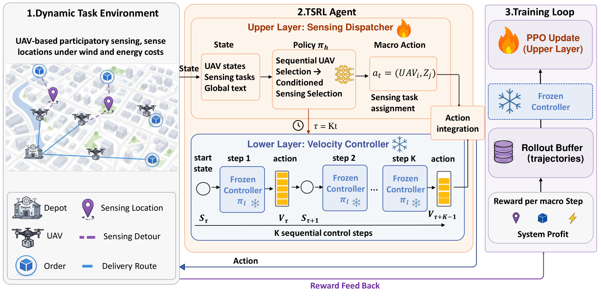

# Reinforcement Learning for Delivery Drone-based Participatory Sensing in Dynamic Environments

Official PyTorch implementation of **SensUAV** and **TSRL** (Two TimeScale Reinforcement Learning) for cooperative UAV fleets that jointly perform urban package delivery and participatory sensing under real order streams and dynamic weather disturbances.

At the **macro** level, a preference-stage PPO policy (`PreferenceStage/train_pref_ppo.py`) selects `(UAV, sensing point)` pairs via a task-embedding factorized dispatcher; at the **micro** level, a frozen RPO/PPO velocity controller (`agents/RPO_ContinusActionSpace.py`) executes `K` low-level steps inside `MacroPreferenceEnv`, aggregating delivery profit, sensing coverage, and energy cost.

## Overview

Using unmanned aerial vehicles (UAVs) for urban participatory sensing has emerged as a powerful paradigm to monitor city status (e.g., air quality and noise levels) through agile aerial crowdsourcing. However, existing UAV-based sensing approaches often overlook environmental disturbances such as wind, which drastically impact drone velocity and energy efficiency.

Directly applying prior methods to the joint delivery-and-sensing paradigm in dynamic environments faces two severe challenges:

1. **Scalability bottlenecks** as fleet sizes expand.
2. **Multi-timescale decision heterogeneity** between macro task dispatching and micro velocity control.

To tackle these, we formalize the problem as **SensUAV** and propose **TSRL**, a cooperative two-layer reinforcement learning framework:

| Layer | Role | Implementation |
|-------|------|----------------|
| **Macro** | Task-embedding sensing dispatcher: encodes distinct task features and sequentially evaluates UAV suitability before task selection | `PreferenceStage/pref_policy.py`, `PreferenceStage/macro_env.py` |
| **Micro** | Wind-aware velocity controller: learns fine-grained velocity scheduling to adapt to dynamic environmental variations | `agents/RPO_ContinusActionSpace.py`, `environments/uav_environment.py` |

Extensive experiments on real-world datasets demonstrate that TSRL significantly outperforms baselines, achieving average system profit improvements of **20.1%** in Hangzhou and **46.6%** in Shanghai.

## Method



At each macro step, the dispatcher selects a `(UAV, sensing point)` pair. The frozen micro policy then executes `K` velocity-control steps under current wind and precipitation conditions. Rewards aggregate delivery profit, sensing completion, and energy consumption.

## Repository Structure

```
├── agents/                     # Low-level RL policies (RPO)
├── PreferenceStage/            # TSRL macro-level training
│   ├── train_pref_ppo.py       # Main TSRL training / evaluation entry
│   ├── pref_policy.py          # Task-embedding factorized dispatcher
│   └── macro_env.py            # Two-timescale environment wrapper
├── environments/               # UAV simulation, order system, sensing tasks
├── baseline/                   # D2SN, DyPS, SMORE, DECO, greedy baselines
├── scripts/                    # Convenience wrappers and analysis tools
│   ├── train_base_ppo.py       # Train micro-level velocity controller
│   ├── train_preference.py     # Train macro-level TSRL dispatcher
├── configs/                    # JSON config templates (Hangzhou / Shanghai)
├── datasets/                   # Data loading, preprocessing, train/val/test splits
├── utilities/                  # Geo utils, sensing reward helpers
├── config.py                   # Unified configuration loader
```

## Installation

```bash
# Python >= 3.10 recommended
pip install gymnasium torch numpy pandas tyro tensorboard

# Optional: experiment tracking and plotting
pip install wandb matplotlib
```

## Data Preparation

TSRL is evaluated on real-world delivery order and hourly weather data from **Hangzhou** and **Shanghai**. Place the following files under `datasets/`:

| City | Orders | Weather |
|------|--------|---------|
| Hangzhou | `hangzhou_region0_101_MayToJuly.csv` | `hourly_data_region101_hz_May_June_July_2022.csv` |
| Shanghai | `shanghai_region1_Aug_to_Oct_clean.csv` | `hourly_data_region87_sh_Aug_Sep_Oct_2022.csv` |

Preprocess daily episode files (Hangzhou example):

```bash
python datasets/preprocess_dataset.py
```

Train/validation/test splits are defined in:

- `datasets/data_split.json` (Hangzhou)
- `datasets/data_split_shanghai.json` (Shanghai)

> **Note:** Raw CSV files are not included in this repository due to size and licensing. Please obtain them separately or contact the authors.

## Quick Start

### Step 1 — Train the micro-level velocity controller

```bash
python scripts/train_base_ppo.py \
    --config_template real_data \
    --seed 42
```

This trains the wind-aware low-level policy using RPO/PPO on the Hangzhou dataset. Checkpoints are saved under `models/` (e.g., `models/best_model_step_<step>.pt`).

### Step 2 — Train TSRL (macro-level dispatcher)

**Hangzhou:**

```bash
python scripts/train_preference.py \
    --config_template pref_stage \
    --base_ppo_path models/best_model_step_<step>.pt \
    --policy_variant factorized \
    --num_uavs 25 \
    --seed 42
```

**Shanghai:**

```bash
python scripts/train_preference.py \
    --config_template pref_stage_shanghai \
    --base_ppo_path models/best_model_step_<step>.pt \
    --policy_variant factorized \
    --num_uavs 25 \
    --seed 42
```

Key arguments:

| Argument | Description |
|----------|-------------|
| `--config_template` | `pref_stage` (Hangzhou) or `pref_stage_shanghai` |
| `--base_ppo_path` | Path to frozen micro-level policy checkpoint |
| `--policy_variant` | `factorized` for TSRL; see Baselines below for others |
| `--K` | Number of micro steps per macro decision (default: 6) |
| `--num_uavs` | Fleet size |
| `--track` | Enable Weights & Biases logging |

### Step 3 — Evaluate

```bash
python scripts/train_preference.py \
    --config_template pref_stage \
    --eval_only \
    --eval_model_path models/preference_ppo/best_val_model.pt \
    --base_ppo_path models/best_model_step_<step>.pt \
    --eval_split test \
    --num_uavs 25 \
    --seed 42
```

## Configuration

All hyperparameters are managed through JSON templates in `configs/`:

| Template | Description |
|----------|-------------|
| `real_data` | Hangzhou real-world data (micro-level training) |
| `pref_stage` | Hangzhou Preference Stage / TSRL macro training |
| `pref_stage_shanghai` | Shanghai Preference Stage / TSRL macro training |
| `debug` | Fast debugging with reduced timesteps |
| `fast_training` | Medium-scale experiments |

Load and inspect a template:

```bash
python -c "from config import print_config, get_config_template; print_config(get_config_template('pref_stage'))"
```

See [`CONFIG_README.md`](CONFIG_README.md) for the full configuration reference.

## Baselines

The following methods can be evaluated via `--policy_variant` in `train_pref_ppo.py`:

| Variant | Method |
|---------|--------|
| `factorized` | **TSRL** (ours) |
| `d2sn` | D2SN |
| `dyps` | DyPS |
| `smore` | SMORE |
| `single_stage_pair` | Single-stage pair selection (ablation) |

Greedy and heuristic baselines are in `baseline/` (e.g., `SensingFirstGreedy`, `DeliveryfirstGreedy`, `DECO_baseline`).

## Analysis Scripts

```bash
# Case-study trajectory plots
python scripts/case_study_plots.py --help

# Runtime latency benchmark aggregation
python scripts/aggregate_runtime.py --help

# Detour candidate scanning
python scripts/detour_scan.py --help
```

## HPC / SLURM

Batch job scripts are provided at the repository root for cluster execution, e.g.:

- `basic_ppo_train.sh` — micro-level training
- `preference_stage_job.sh` — TSRL macro training
- `baseline_*_job.sh` — baseline experiments

## Citation

If you use this code, please cite:

```bibtex
@article{tsrl_sensuav,
  title   = {Reinforcement Learning for Delivery Drone-based Participatory Sensing in Dynamic Environments},
  author  = {},
  journal = {},
  year    = {},
}
```

## License

This project builds upon [CleanRL](https://github.com/vwxyzjn/cleanrl) and follows its open-source license.

## References

- [CleanRL](https://github.com/vwxyzjn/cleanrl) — PPO/RPO reference implementation
- [RPO](https://arxiv.org/abs/2310.01465) — Relative Policy Optimization
- [Gymnasium](https://gymnasium.farama.org/) — RL environment interface
